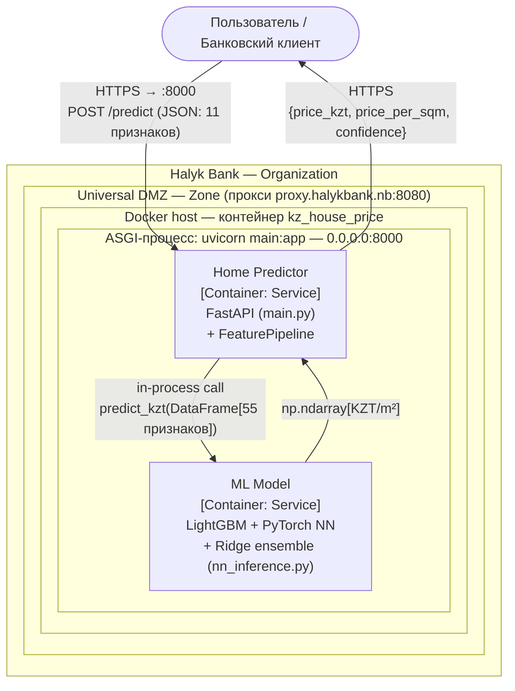
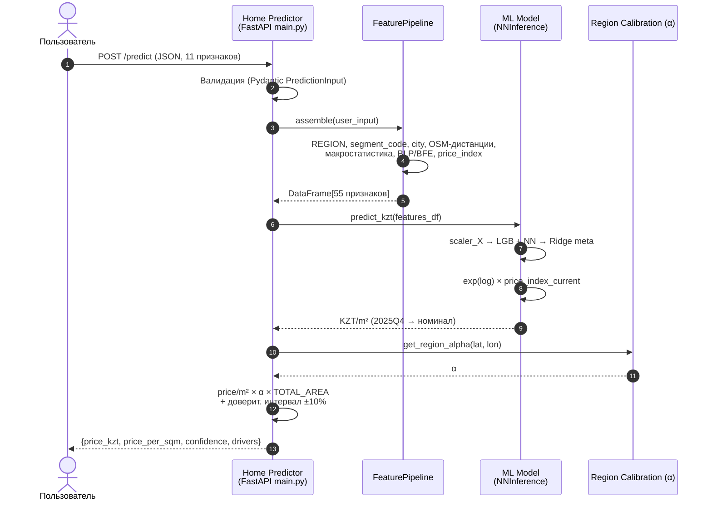
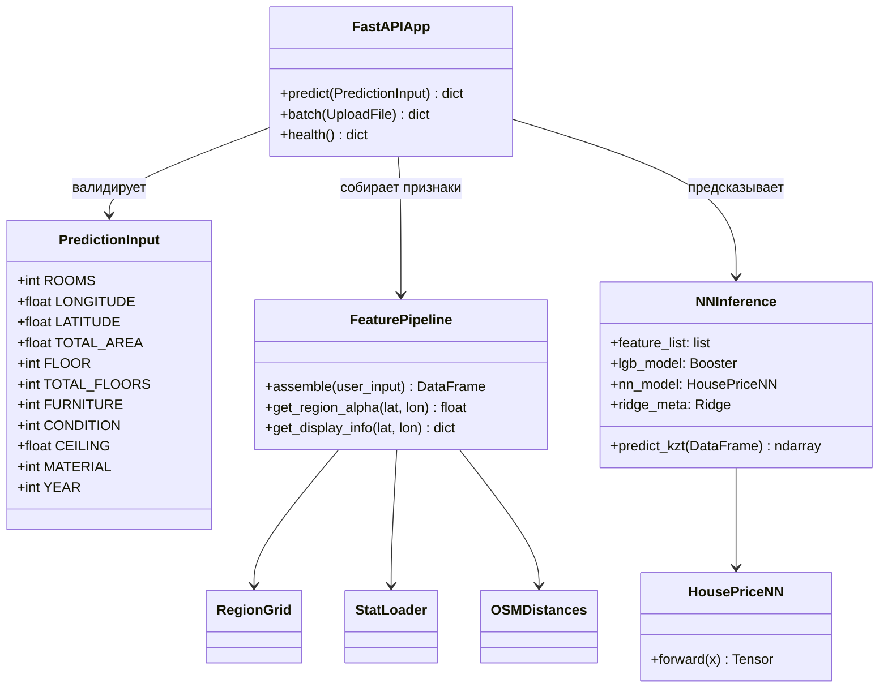
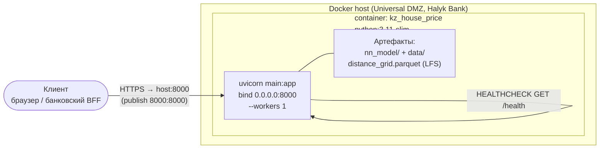

# UML-диаграммы сервиса hpwhd

Диаграммы отражают архитектуру сервиса оценки стоимости квартир и обмен данными
между **Home Predictor** и **ML Model**, а также среду выполнения (Docker /
uvicorn :8000 внутри Universal DMZ Halyk Bank).

> Все диаграммы — на Mermaid и рендерятся прямо в GitHub. PlantUML-вариант
> C4 приведён в конце.

---

## 1. C4 Container — компоненты и обмен данными



---

## 2. Sequence — сценарий одного прогноза `/predict`



---

## 3. Component / Class — ключевые классы



---

## 4. Deployment — среда выполнения (ИС / адрес сервера)



**Параметры среды (ИС / сервер):**

| Параметр | Значение |
|----------|----------|
| Рантайм / ИС | Docker-контейнер `kz_house_price`, ASGI-сервер uvicorn (Python 3.11-slim) |
| Внутренний bind | `0.0.0.0:8000` |
| Публикация порта | host `8000` → container `8000` |
| Внешний вход | HTTPS → reverse-proxy → `http://<host>:8000` |
| Health-check | `GET /health` |
| Зона / организация | Universal DMZ, Halyk Bank |
| Корпоративный прокси | `proxy.halykbank.nb:8080` |

> ⚠️ Обмен «Home Predictor → ML Model» в текущей реализации — **внутренний вызов
> функции Python** (`predict_kzt`), оба компонента живут в одном процессе/контейнере.
> На C4-диаграмме стрелка показана как логический интерфейс «запрос 55 признаков →
> ответ KZT/m²».

---

## 5. PlantUML — C4 Container (альтернатива)

```plantuml
@startuml
!include https://raw.githubusercontent.com/plantuml-stdlib/C4-PlantUML/master/C4_Container.puml

Person(user, "Пользователь", "Банковский клиент / оператор")

System_Boundary(org, "Halyk Bank") {
  System_Boundary(dmz, "Universal DMZ") {
    Container(hp, "Home Predictor", "FastAPI, Python 3.11 (main.py)", "Приём запроса, сборка 55 признаков, пост-калибровка")
    Container(ml, "ML Model", "LightGBM + PyTorch NN + Ridge (nn_inference.py)", "Инференс цены за м²")
  }
}

Rel(user, hp, "POST /predict (JSON, 11 признаков)", "HTTPS :8000")
Rel(hp, ml, "predict_kzt(DataFrame[55]) → KZT/m²", "in-process call")
Rel(ml, hp, "np.ndarray[KZT/m²]", "return")
Rel(hp, user, "{price_kzt, confidence}", "HTTPS")
@enduml
```
